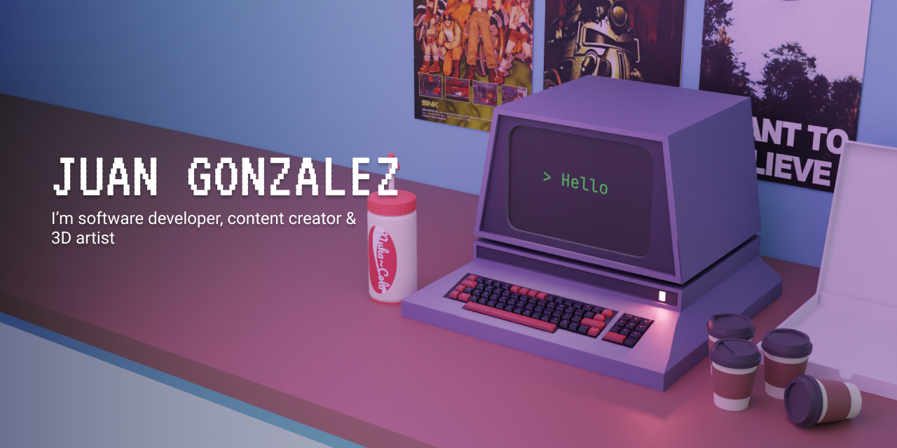

 

## Acerca de mi 🧑‍💻
Hola, soy un desarrollador Full-Stack basado en México. Me encanta trabajar con tecnologías web y mézclelos con 3D para hacer páginas con un diferente sabor y sensación.
Además, he trabajado con Back-End tecnologías, como .NET, ASP.NET y SQL Server, y con servicios en la Nube como Azure y Azure DevOps. 
Estoy abierto a trabajar con nuevas tecnologías para resolver nuevos desafíos y obtener nuevas oportunidades

## Tecnologias
### Front-End
</img>
</img>
</img>
</img>
</img>
</img>
</img>

### Back-End
 </img>
 </img>
</img>
 </img>
</img>

### Design 
 </img>
</img>

## Dale uno ojo a mis redes sociales 🤝​

<a href="https://github.com/SirJohn72-script"></img></a>
<a href="https://www.youtube.com/c/JohnScript72"></img></a>
<a href="https://john-portfolio-eight.vercel.app"> </img> </a>
